# All-Optical Neural Network Simulation

Author: Zijia Feng

Date: 2023.8.13

需要中文文档的同学，请参照[README_ZH.md](./README_ZH.md)

## Running Instructions

File Descriptions:

This project implements a simulation of an all-optical neural network, achieving up to 97% accuracy on MNIST (of course, with a nonlinear that is impossible in reality).

The train folder is used for training, and the predict folder for prediction.

This document details the principles and implementation process. It is recommended to read the project documentation before accessing the train and predict folders. The source code involved in the project documentation is mainly contained in the train folder.

Both train and predict folders contain a README.txt file, which should be read before running the files. Be sure to read README.txt before running train. Please, be sure to read it, please be sure to read it, please be sure to read it.

The preprocessing method is in the train folder's torch_prepro.py file. If you encounter any problems with preprocessing or any step of the running, feel free to click on issue to provide feedback OR contact the author.

Literature is the references for this project, which can be compared with the references at the end of the project document.

## Project Introduction

The architecture of classical neural networks is well-known. Neural networks are mostly trained and inferred on GPU platforms. In the paper by Lin etc., they proposed a novel neural network architecture based on light diffraction and phase modulation, $D^2NN$ (Deep Diffractive Neural Network). [^1](#reference) All-optical neural networks have unique advantages in inference tasks, including **low energy consumption and near-light speed**. [^3](#reference)

This project uses `Python + Pytorch` to simulate all-optical neural networks and applies it to MNIST handwritten digit recognition, achieving an accuracy of $93.5\%$, which is higher than the $91.75\%$ in the original paper. The project continues to explore methods to improve the model architecture, achieving a simulation accuracy of $96.5\%$ after introducing relevant improvements.

This project mainly refers to the paper [All-optical machine learning using diffractive deep neural networks](https://www.science.org/doi/10.1126/science.aat8084). Please refer to the source folder for preprocessing and training code, and the model folder for prediction.

## Basic Principles

The basic architecture of the network consists of three types of `layers`: the propagation layer `propagation_layer` that manages the spatial free propagation of light waves, the modulation layer `modulation_layer` that modulates the phase and amplitude of light, and the imaging layer `imaging_layer` that finally performs prediction.

The training process is divided into forward propagation and backpropagation, while the inference process can be completed by forward propagation alone.

### Forward Propagation

In forward propagation, the network completely simulates the physical propagation of light.

Initially, a beam of coherent light is directed into a hollowed-out digit to obtain the incident light field (input plane), followed by light propagation in free space, determined by Fresnel diffraction. Phase and amplitude modulation pieces (L1, L2...) are added at equal intervals during light propagation. The final imaging screen contains ten squares, each representing a digit, and the square with the highest light intensity is the prediction result of the all-optical neural network.

The architecture is displayed in the following diagram[^1](#paper):

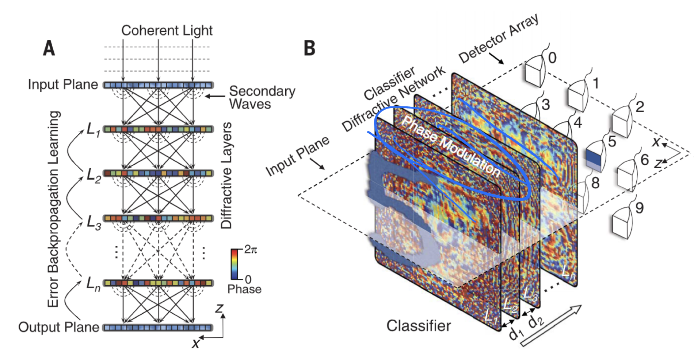

The final effect is shown below.

| 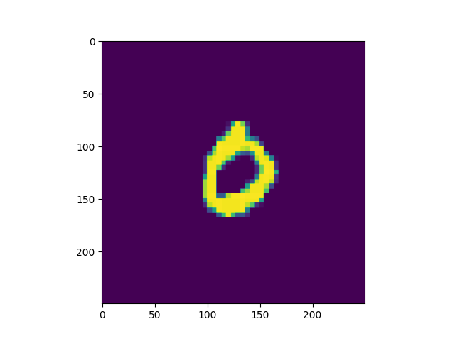 | 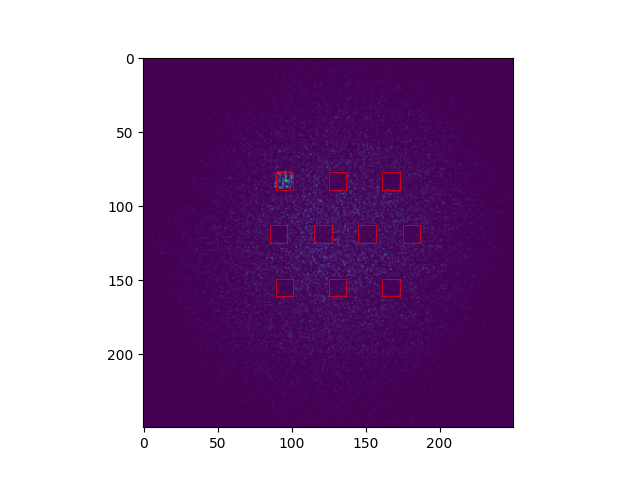 |
|:---:|:---:|
| Incident light field distribution | Imaging light intensity distribution |

It can be seen that the light intensity in the first square is significantly higher than the other squares, thus 0 is the prediction result of this neural network.

### Backpropagation

The phase and amplitude modulation pieces in the `modulation_layer` are the only learnable parameters in the network, controlling light propagation. Their update is completed using the gradient descent method. The final modulation pieces are shown below:

| 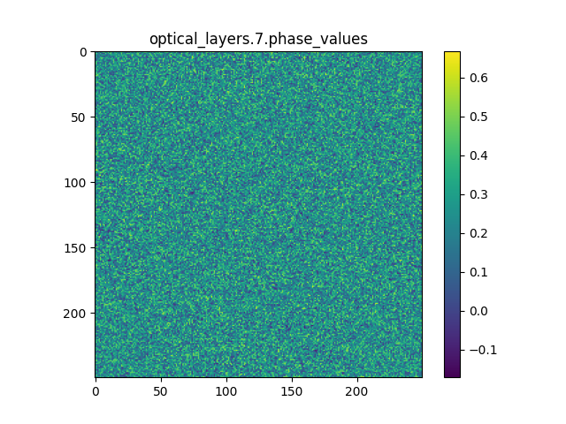 | 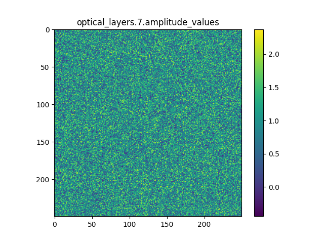 |
|:---:|:---:|
| Phase modulation | Amplitude modulation |

## Environmental Configuration

Use vscode ssh to connect to the Jingyi Science Association server for training.

Software environment: `torch '2.0.1+cu117' + numpy '1.23.5'`

Hardware environment: `NVIDIA GeForce RTX 3090` (Jingyi Science Association server)

Dataset: MNIST handwritten digit recognition

## Code Implementation

### OpticalNetwork

Related code is in `train.py`, `onn_am.py`, and `layer_show.py`. The first code is the core training code, the second code only contains the optical network, and the third code displays the work of the propagation and modulation layers.

The author's own `OpticalNetwork` class inherits from `torch.nn`. Its implementation can be referred to separately in [onn_am.py](./support_images/onn_am.py). The class contains three layers: the propagation layer `propagation_layer`, the modulation layer `modulation_layer`, and the imaging layer `imaging_layer`.

`propagation_layer` simulates the change in the light field before and after light propagates a certain distance z in free space. The author uses the Fresnel transfer function (Transmittive Function, TF) method, referring to [Computational Fourier Optics](https://www.spiedigitallibrary.org/ebooks/TT/Computational-Fourier-Optics-A-MATLAB-Tutorial/eISBN-9780819482051/10.1117/3.858456?SSO=1) to complete the `propTF()` function. The result after a propagation layer is shown below.

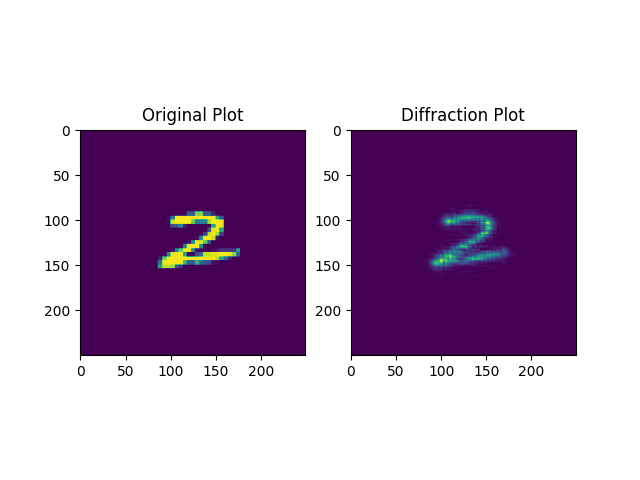

It can be seen that the convolution effect of free space propagation causes some blurring of the image.

The Fresnel transfer function method can retain second-order small quantities under the paraxial approximation using the angular spectrum method. Its principle is detailed in [Goodman: Introduction to Fourier Optics, Edition 4th](https://www.semanticscholar.org/paper/Introduction-to-Fourier-optics-Goodman/5e3eb22c476b889eecbb380d012231d819edf156). Its implementation is detailed in the training code `train.py`.

`modulation_layer` mainly introduces phase and amplitude modulation pieces. The modulation pieces have the same size as the sampling space. As the only adjustable parameter layer, the phase and amplitude modulation parameters can be directly called using `loss.backward()` for calculation and `optimizer.step()` for updates.

Below is the light intensity distribution after random phase modulation and propagation over distance $z$.

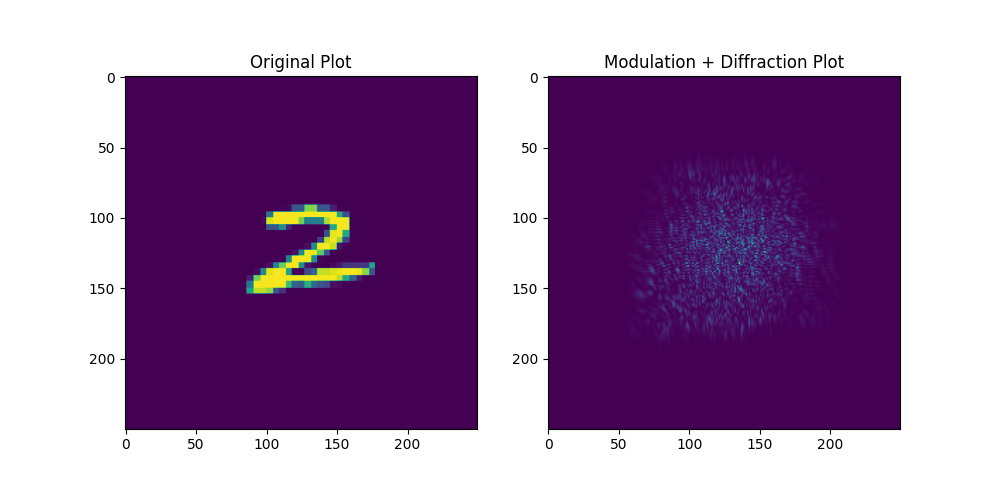

`imaging_layer` completes the tasks of imaging and output. After calculating the total light intensity, the `imaging_layer` will statistically analyze the light intensity in each square and normalize it, outputting a tensor of dim = 10, with the highest light intensity being the prediction result.

For example, in the lower right image, the corresponding tensor is:

0.1584, 0.1126, 0.1083, 0.1370, 0.1285, 0.8973, 0.1393, 0.1145, 0.2016, 0.1920


It is evident that `tensor[5]` has the largest value, thus 5 is our prediction result.

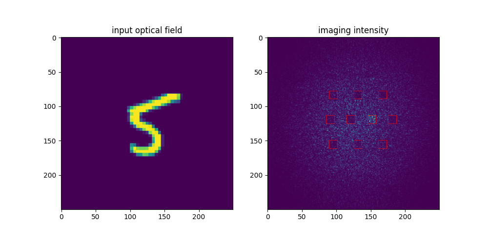

It is particularly important to note: the normalization operation in `imaging_layer` cannot be completed in-place, otherwise gradient calculation will be erroneous. A new `value_` array must be defined and then returned.

The final model consists of

$\rm 5 \times propagation\_layer + 5 \times modulation\_layer + imaging\_layer$

The model's loss function uses `MSELoss()`, and the parameter initialization method selects `kaiming_uniform_` or `uniform_`, with `Adam` as the optimizer.

### Parameters

These are fixed parameters; only the parameters and their meanings are listed here, with the reasons for their selection discussed in "Reasons for Parameter Selection"

Optical parameters

```
M = N = 250 # sampling count on each axis
lmbda = 0.5e-6 # wavelength of coherent light
L = 0.2 # the area to be illuminated
w = 0.051 # the half-width of the light transmission area
z = 100 # the propagation distance in free space
```

When using the entire MNIST dataset for training, the neural network parameters are:
```
learning_rate = 0.003
epochs = 6
batch_size = 128
```


### Data Preprocessing

The related code is in `prepro.py` and `prepro_label.py`. The core involves resizing the images to $(2w) \times (2w)$ and embedding them in an $L \times L$ square area. This generates all images as $M \times M$, unifying the shape of the incident light field. The before and after comparison is shown below.

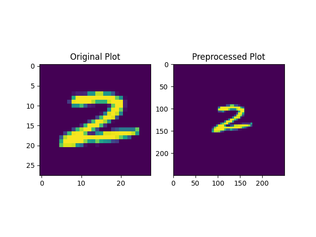

Label preprocessing involves expanding a number into a dim = 10 array. If label = $i$, then generate the unit vector $e_{i+1}$.

After preprocessing, save as an npy file for easy transfer and reading on different devices.

### Data Reading

Small batch data reading can be directly completed through `np.load()`, but the training data of MNIST exceeds the GPU memory limit, so it must be completed through dataloader. Specific code refer to `train.py` or `train_am.py`.

## Model Performance and Analysis

### Training Performance

The following results did not include amplitude modulation, only phase modulation. The results with amplitude modulation will be discussed in the next section "Model Optimization".

Initially, the author used the first $2\%$ of MNIST for training and testing, that is, $ \rm 1000 \times train + 200 \times validation + 200 \times test$.

If using params:

```
learning_rate = 0.003
epochs = 20
batch_size = 128
```

A training and testing session takes about 50s, which is convenient for parameter tuning. Below is one of the output results, with the weights saved to `weights_small.pt`

```
Using cuda device
Epoch [1/20], Training Loss: 0.1198, Training Accuracy: 70.10%,
...
Epoch [20/20], Training Loss: 0.0255, Training Accuracy: 95.90%,
Validation Loss: 0.0397, Validation Accuracy: 87.50%
Test Accuracy: 90.50%
```


On a small batch dataset, the author achieved a test accuracy of up to 92.5%. The average accuracy is about $91\%$

Later, the author used the entire MNIST for training and testing, that is, $ \rm 50000 \times train + 10000 \times validation + 10000 \times test$. Using parameters

```
learning_rate = 0.003
epochs = 6
batch_size = 128
```

A training and testing session takes about 40 minutes. Below is one of the output results, with the weights saved to `weights_large.pt`.

```
Epoch [6/6], Training Loss: 0.0243, Training Accuracy: 92.86%,
Validation Loss: 0.0225, Validation Accuracy: 93.64%
Test Accuracy: 92.65%
```


On a large batch dataset, the validation set accuracy exceeded $93.5%$, and the test set accuracy also exceeded $92.5\%$. Without amplitude modulation, the simulation result in the original paper was $91.75\%$. The results are close.

We list the `confusion_matrix` for both large batch data and small batch data for comparison.

|Large batch data|Small batch data|
|--|--|
|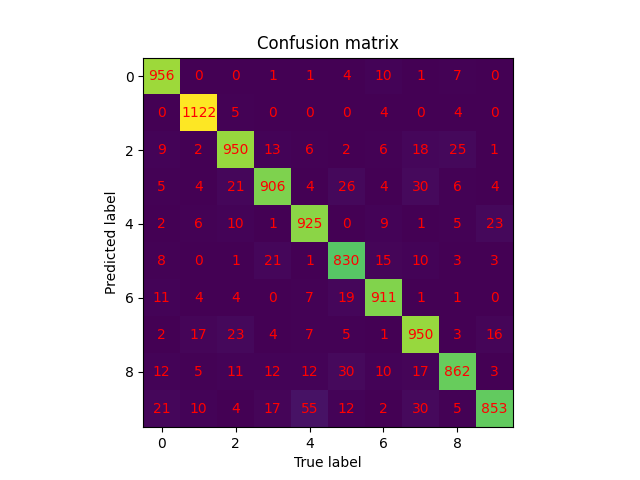||

### Result Display

We demonstrate the model's prediction performance by listing the normalized output results `output` and comparing the incident light field with the final imaging light intensity.

+ Without amplitude modulation

```
[0.1320, 0.1467, 0.2757, 0.6138, 0.3394, 0.4097, 0.3318, 0.1327, 0.2697, 0.1574]
```


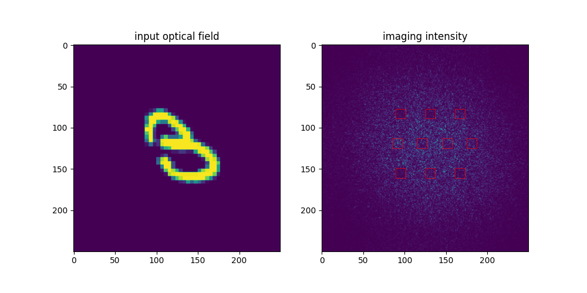

```
[[0.0817, 0.1322, 0.1069, 0.3428, 0.1222, 0.1302, 0.0683, 0.0961, 0.8899, 0.0956]]
```

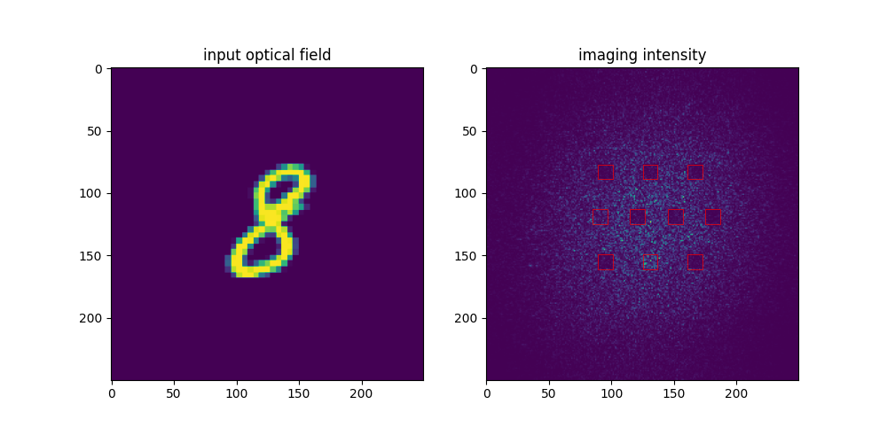 

+ With amplitude modulation:

```
[[0.0813, 0.1146, 0.2029, 0.3622, 0.7564, 0.1387, 0.0544, 0.0728, 0.2183, 0.4007]]
```


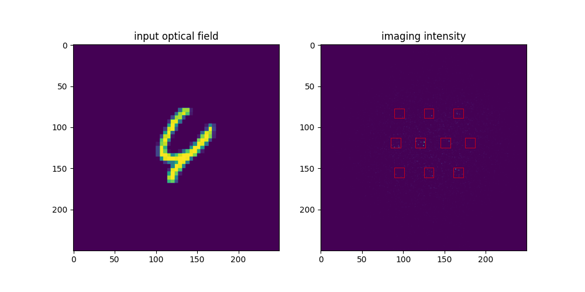

[[0.0088, 0.0123, 0.0308, 0.0656, 0.1741, 0.0357, 0.0339, 0.3735, 0.0609, 0.9047]]


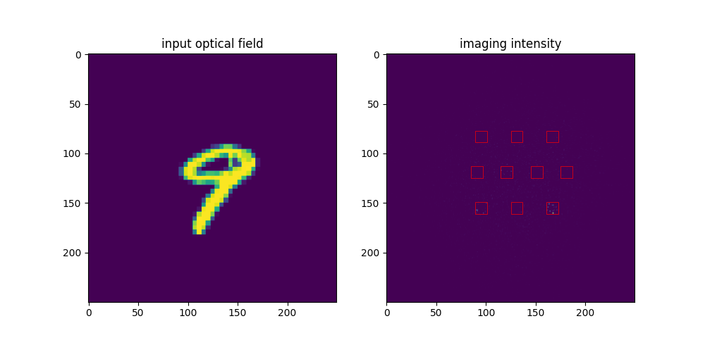

Comparison images are generated in `predict.py` and `predict_am.py`.

## Running Guide

step1: Preprocessing

Run prepro.py & prepro_label.py to generate the preprocessed light field distribution and save it as an npy file. Be sure to modify the parameters according to the hints in the prepro.py file.

step2: Model Training

We provide two types of models here: large.py, large_am.py. The former only has phase modulation, while the latter introduces both amplitude and phase modulation. Change the filename to match the file name generated by prepro.py.

step3: Model Prediction

Run `predict.py` or `predict_am.py` according to the type of model trained in the previous step. Change line 157 in
`u0 = test_data_transposed[17]` to the data you want to run. This will generate the final comparison images, as shown in the previous section.

## Model Optimization

Here we mainly discuss the optimization of the model architecture, with the reasons for parameter choices detailed in the next chapter: Reasons for Selection. This section proposes four optimization methods: increasing the number of layers, adding amplitude modulation, introducing nonlinear activation functions, and changing the propagation distance.

Adjusting the architecture, all small batch data use parameters lr = 0.003, epoch = 20. Phase initialization uses a uniform distribution in $(0,4\pi)$. Large batch data all use parameters lr = 0.003, epoch = 6. Phase initialization uses a uniform distribution in $(0,4\pi)$

### Increasing Layer Count

The most obvious method in adjusting architecture is to increase the number of layers. The experimental results on small batch data are shown below:

|Number of layers|Accuracy|
|--|--|
|1|8.5%|
|2|63.5%|
|3|87.5%|
|4|89.0%|
|5|90.5%|
|8|92.0%|
|12|92.5%|

It is evident that increasing the number of layers can significantly improve accuracy, but in real life, this is more difficult to manufacture and use, and manufacturing process errors may increase. 5-8 layers should be a suitable and balanced choice.

### Adding Amplitude Modulation

Related code is in all files ending with `am`. All files ending with `am` represent `amplitude modulation`.

Secondly, amplitude modulation is added on top of phase modulation.

Below are the training results on the full MNIST set. Through comparison, adding amplitude modulation can significantly improve accuracy without adding much training time. However, it increases complexity in real-world applications.

||With amplitude modulation|Without amplitude modulation|
|--|--|--|
|test|93.4%|92.5%|
|validation|93.9%|93.5%|

```
Epoch [6/6], Training Loss: 0.0203, Training Accuracy: 93.64%,
Validation Loss: 0.0191, Validation Accuracy: 93.86%
Test Accuracy: 93.40%
```


|With amplitude modulation|Without amplitude modulation|
|--|--|
|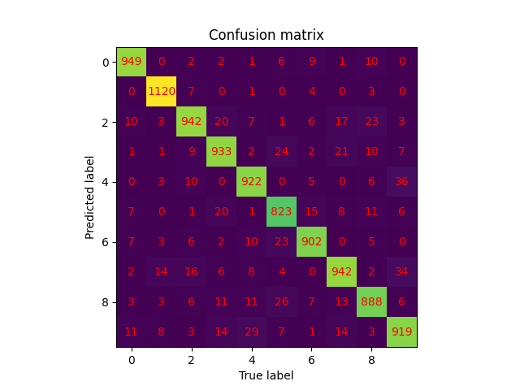||

### Nonlinear Activation

Although the model naturally introduces certain nonlinear factors in the propagation process `propagation_layer`, the overall implementation still relies on linear superposition. Introducing a nonlinear activation function will positively impact the model. Therefore, this paper introduces a complex ReLU function `crelu`^6, adjusting the light field completed by `modulation`, ultimately achieving an accuracy of over $97\%$.

```python
def crelu(x):
    return torch.relu(x.real) + j * torch.relu(x.imag)
```

It is particularly noteworthy that introducing crelu may result in all imaging results being zero, which may cause problems in the normalization calculation of norm. At this time, we can solve this problem by giving norm a baseline. The code is detailed in large_relu.py, simply change norm to `norm_nonzero`.

||with relu|without relu|
|--|--|--|
|test|96.98%|92.5%|
|validaiton|97.01%|93.5%|

```
Epoch [6/6], Training Loss: 0.0046, Training Accuracy: 98.80%, 
Validation Loss: 0.0059, Validation Accuracy: 97.01%
Test Accuracy: 96.98%
```

It is worth noting that using csigmoid does not achieve similar effects. This indicates that applying sigmoid to complex values cannot be completed simply by applying it to the real and imaginary parts.

```
Epoch [1/6], Training Loss: 0.1367, Training Accuracy: 11.36%, 
Validation Loss: 0.1367, Validation Accuracy: 10.64%
```

The major disadvantage of this method is the difficulty of its physical implementation. Currently, it is difficult to find a suitable and convenient optical medium to introduce complex activation functions. $^3$

### Changing propagating distance

Related code is in `changez.py`.

This approach changes z, making z a learnable parameter. Testing on small batch data showed that using a high learning rate caused z to fluctuate dramatically, with accuracy fluctuating around 10%, as shown in the left image; whereas a low learning rate almost does not change z, as shown in the right image. Therefore, this modification was abandoned.

| 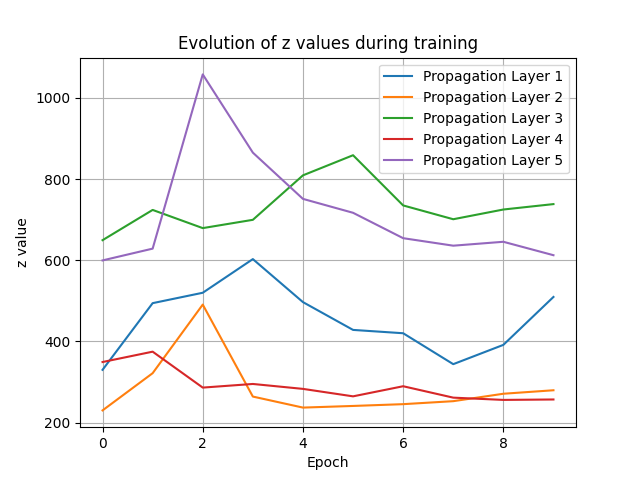 | 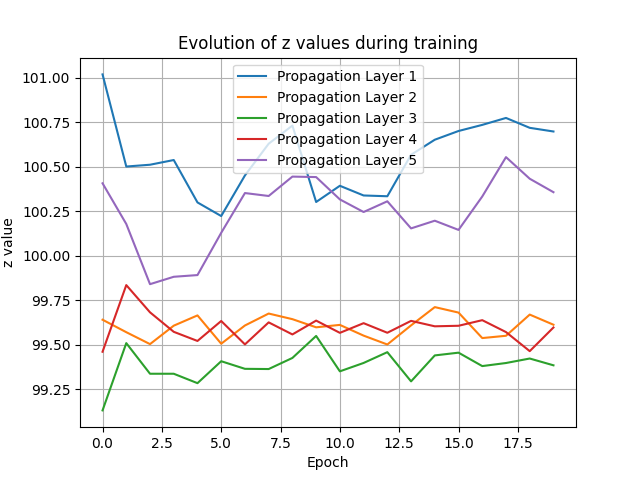 |
|:---:|:---:|
| lr = 20 | lr = 1 |

### Using Distributed Computing

Drawing from the method of shared weights and biases in convolutional neural networks, the implementation method in this project is to add several parallel connection layers. See `large_dn1n_final.py` for details.

This training is incredibly slow... It didn't finish after two runs. The effect was not very good, indicating that at this level of nonlinearity, we have reached the limit.

Illustration: (Referencing the Zhou etc. 2021 article, inspiration from reconfigurable ONN)


```
weights_large_dn1n_feature20.pt
Epoch [4/5], Training Loss: 0.0208, Training Accuracy: 93.37%,
Validation Loss: 0.0191, Validation Accuracy: 94.05%
Epoch [5/5], Training Loss: 0.0205, Training Accuracy: 93.73%,
Validation Loss: 0.0187, Validation Accuracy: 93.91%
Test Accuracy: 93.29%
```


Results:
|                   | validation set | test set |
| ----------------- | -------------- | -------- |
| 2 epoches + crelu | 96.95%         | 96.91%   |
| 5 epoches         | 93.91%         | 93.29%   |

### Switching Propagation Simulation Methods

Using the long-distance transmission correction method in `propagation_ASM.py`, training code in `provided_large.py`. The effect showed no significant difference.

### Incoherent Propagation

Prediction in `predict_inco.py`, where inco stands for incoherent.

Training in `large_inco.py`. Weights are also made public. Performance-wise, the best after incoherent was about 58%. According to Professor Lin Xing, this is because incoherent light does not have negative value operations.


## Reasons for Parameter Selection

### Optical Parameters

```
M = N = 250 # sampling count on each axis
lmbda = 0.5e-6 # wavelength of coherent light
L = 0.2 # the area to be illuminated
w = 0.051 # the half-width of the light transmission area
z = 100 # the propagation distance in free space
```


Parameter $w$ was predetermined, following the method in the Computational book, while the selection of $L$ is based on the Nyquist law. To simulate real optical conditions, we need to sample the light field properly. The required sampling range should be larger than the actual light field range, with the expansion ratio set as Q. The Fresnel number $N_F = w ^2 / (z \times \lambda)$ we combine with the diagram in Goodman: Introduction to Fourier Optics to choose Q slightly less than 2.


Our selection of the $M$ parameter has some flaws; if a larger value was chosen, it might reduce aliasing more effectively. However, considering the training cost and preprocessing cost are proportional to $M ^ 2$, we use $M = 250$ for simulation, which is a compromise between efficiency and performance.

The choice of $z$ is based on preliminary propagation simulation experiments. The `propTF` method maintains higher clarity at smaller $z$, and $z = 100$ allows for some diffraction phenomena without causing the image to appear repetitive or widely blurred.

### Neural Network Parameters

Adjustment of neural network parameters mainly relies on experimental results.

It is particularly worth mentioning that the paper provided a $\rm batch\_size = 8$. However, when the author personally experimented with $\rm batch\_size = 8$, accuracy generally fluctuated around 80%, and this caused much frustration. Changing to 128 broke this limit and had a better effect.

`lr` should not be too high or too low. Under the condition of the full MNIST set, $\rm  test\_accuracy$ and $\rm validation\_accuracy $ are generally aligned, temporarily observing no overfitting phenomena, indicating that an `lr` of $0.003$ is relatively large, serving a certain regularizing function.

## Reference

<div id="paper"></div>

- [1] [Xing Lin et al., All-optical machine learning using diffractive deep neural networks. Science 361, 1004-1008 (2018). DOI:10.1126/science.aat8084](https://www.science.org/doi/10.1126/science.aat8084)

<div id="sup"></div>

- [2] [All-optical machine learning using diffractive deep neural networks: Materials and Methods](https://www.sciencemag.org/content/361/6406/1004/suppl/DC1)

<div id="inf"></div>

- [3] [Wetzstein, G., Ozcan, A., Gigan, S. et al. Inference in artificial intelligence with deep optics and photonics. Nature 588, 39–47 (2020).](https://doi.org/10.1038/s41586-020-2973-6)


<div id="computational"></div>

- [4]: [Computational Fourier Optics: A MATLAB tutorial](https://www.spiedigitallibrary.org/ebooks/TT/Computational-Fourier-Optics-A-MATLAB-Tutorial/eISBN-9780819482051/10.1117/3.858456?SSO=1)

<div id="goodman"></div>

- [5] [Goodman: Introduction to Fourier Optics, Edition 4th](https://www.semanticscholar.org/paper/Introduction-to-Fourier-optics-Goodman/5e3eb22c476b889eecbb380d012231d819edf156)

- [6] [Complex-valued convolutional neural networks for real-valued image classification](https://ieeexplore.ieee.org/abstract/document/7965936)


